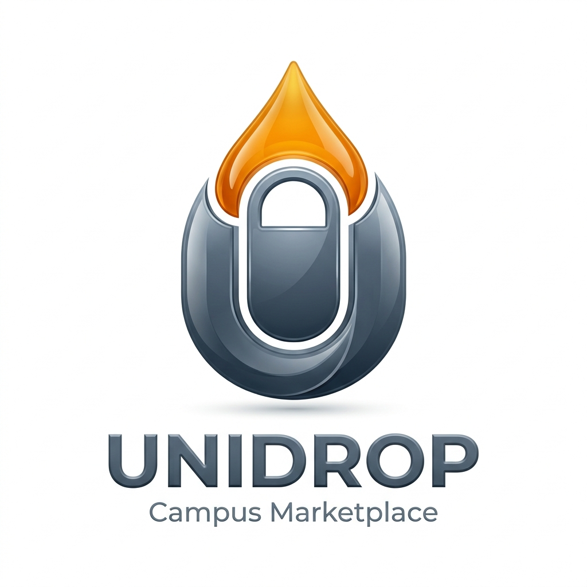

# 🚀 UniDrop — The Ultimate Campus Marketplace

UniDrop is a modern, premium marketplace designed specifically for university campuses. It enables students to buy, sell, and request deliveries for food, provisions, electronics, and more, all within their campus ecosystem.



## ✨ Features

- **🛍️ Multi-Vendor Marketplace**: Students can list their products and manage their own mini-store.
- **💳 Secure Payments**: Integrated with **Paystack** for seamless and secure GHS transactions.
- **🚚 Smart Delivery System**: Automated delivery agent assignment for on-campus orders.
- **💰 Financial Transparency**: Built-in wallet system for sellers with pending and withdrawable balances.
- **📱 Responsive Design**: A stunning, mobile-first interface with light and dark mode support.
- **🛡️ Admin Console**: Powerful oversight tools for managing users, listings, and payouts.

## 🛠️ Technology Stack

- **Frontend**: React + Vite + TypeScript
- **Styling**: Tailwind CSS + Shadcn UI
- **Backend/DB**: Supabase (PostgreSQL + Auth + Realtime)
- **Payments**: Paystack API

## 🚀 Getting Started

### Prerequisites

- Node.js (v18+)
- npm or yarn
- A Supabase project
- A Paystack account

### Installation

1. **Clone the repository**:
   ```bash
   git clone https://github.com/mkastack/unidrop.git
   cd unidrop
   ```

2. **Install dependencies**:
   ```bash
   npm install
   ```

3. **Set up Environment Variables**:
   Create a `.env` file in the root directory and add your credentials:
   ```env
   VITE_SUPABASE_URL=your_supabase_url
   VITE_SUPABASE_PUBLISHABLE_KEY=your_supabase_key
   VITE_PAYSTACK_PUBLIC_KEY=your_paystack_key
   ```

4. **Run the development server**:
   ```bash
   npm run dev
   ```

## 🏗️ Project Structure

- `/src/pages`: Main application routes (Cart, Shop, Dashboards).
- `/src/components`: Reusable UI components.
- `/src/contexts`: Authentication and global state.
- `/src/integrations`: API clients (Supabase).
- `/supabase/migrations`: Database schema and RLS policies.

## 📄 License

This project is licensed under the MIT License.

---
Built with ❤️ for the campus community.
